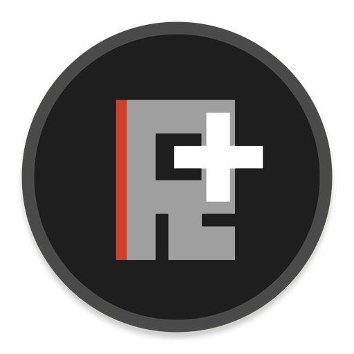

</a>

# RustPlusBot plugins reference and examples

**RustPlusBot** plugins allow the user to develop their own commands to add functionality to the bot. The plugin itself exposes many events for a programmer to attach to and execute code.

The plugins are written in JavaScript and run in a NodeJS environment.

## Plugin Events:

<ul>
  <li><code>onConnected()</code> Fires when the bot connects to a server</li>
  <li><code>onDisconnected()</code> Fires when the bot disconnects from a server</li>
  <li><code>onEntityChanged(obj)</code> Fires when a paired Smart Device is changed<ul><li><b>obj.entityId</b>: The entity ID of the Smart device</li><li><b>obj.payload</b>: The payload data of the event (see <code>Payload</code> below)</li></ul></li>
  <li><code>onMessageReceive</code> Fires when a team chat message is received<ul><li><b>obj.message</b>: The incoming team chat message</li><li><b>obj.name</b>: The steam name of the sender</li><li><b>obj.steamId</b>: The steam ID of the sender</li></ul></li>
  <li><code>onMessageSend</code> Fires when a team chat message is sent<ul><li><b>obj.message</b>: The outgoing team chat message</li></ul></li>
  <li><code>onNotification</code> Fires when there is a bot notification<ul><li><b>obj.notification</b>: The notification data of the event (see <code>Notification</code> below)</li></ul></li>
  <li><code>onTeamChanged</code> Fires when the team leader changes, or a team member is added or removed from the team<ul><li><b>obj.leaderSteamId</b>: The steam ID of the team leader</li><li><b>obj.leaderMapNotes</b>: The leader map notes data of the event (see <code>LeaderMapNotes</code> below)</li><li><b>obj.members</b>: The members list data of the event (see <code>Members</code> below)</li></ul></li>
</ul>
